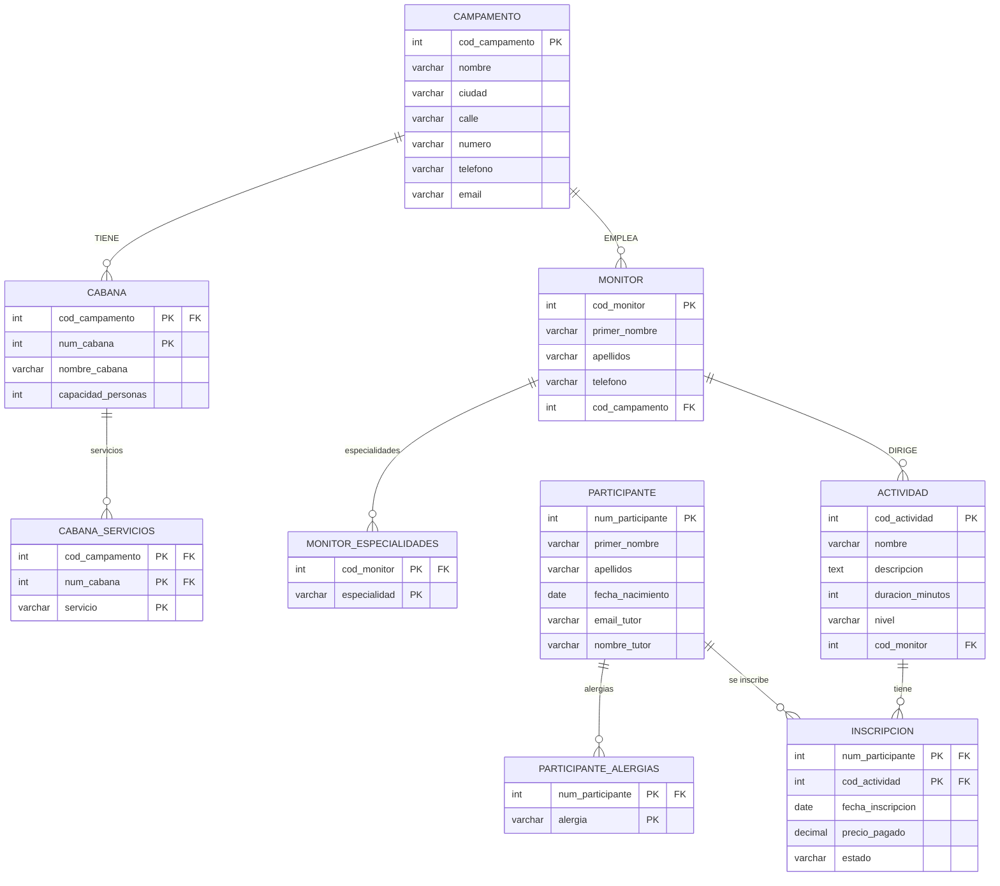

# SOLUCIÓN — Práctica Clase 10
**Del E-R al modelo relacional — Sistema de campamento de verano**

---

## Esquema relacional completo

### 1. CAMPAMENTO
```
CAMPAMENTO(cod_campamento INT [PK], nombre VARCHAR, ciudad VARCHAR, calle VARCHAR, número VARCHAR, teléfono VARCHAR, email VARCHAR)
```
**Regla R1** — entidad fuerte.
**Regla R2** — `dirección` (compuesto) se aplana: `calle` y `número` son columnas independientes.

---

### 2. CABAÑA
```
CABAÑA(cod_campamento INT [PK, FK → CAMPAMENTO], num_cabaña INT [PK], nombre_cabaña VARCHAR, capacidad_personas INT)
```
**Regla R5** — entidad débil. PK = (cod_campamento, num_cabaña).
La FK `cod_campamento` no puede ser NULL porque CABAÑA tiene participación total con CAMPAMENTO
(toda cabaña pertenece a un campamento — regla de débil).

---

### 3. CABAÑA_SERVICIOS
```
CABAÑA_SERVICIOS(cod_campamento INT [PK, FK → CABAÑA], num_cabaña INT [PK, FK → CABAÑA], servicio VARCHAR [PK])
```
**Regla R4** — atributo multivaluado `servicios` de CABAÑA.
La FK hacia CABAÑA es compuesta (cod_campamento + num_cabaña) porque la PK de CABAÑA es compuesta.

---

### 4. MONITOR
```
MONITOR(cod_monitor INT [PK], primer_nombre VARCHAR, apellidos VARCHAR, teléfono VARCHAR, cod_campamento INT [FK → CAMPAMENTO])
```
**Regla R1** — entidad fuerte.
**Regla R2** — `nombre_completo` (compuesto) se aplana.
**Regla R6** — relación 1:N CAMPAMENTO–MONITOR: FK `cod_campamento` va en MONITOR (lado N).
MONITOR tiene participación total → `cod_campamento` es NOT NULL.

---

### 5. MONITOR_ESPECIALIDADES
```
MONITOR_ESPECIALIDADES(cod_monitor INT [PK, FK → MONITOR], especialidad VARCHAR [PK])
```
**Regla R4** — atributo multivaluado `especialidades` de MONITOR.

---

### 6. PARTICIPANTE
```
PARTICIPANTE(num_participante INT [PK], primer_nombre VARCHAR, apellidos VARCHAR, fecha_nacimiento DATE,
             email_tutor VARCHAR, nombre_tutor VARCHAR)
```
**Regla R1** — entidad fuerte.
**Regla R2** — `nombre_completo` se aplana.
**Regla R3** — `edad` (derivado) **no aparece**.

---

### 7. PARTICIPANTE_ALERGIAS
```
PARTICIPANTE_ALERGIAS(num_participante INT [PK, FK → PARTICIPANTE], alergia VARCHAR [PK])
```
**Regla R4** — atributo multivaluado `alergias` de PARTICIPANTE.
Como `alergias` también es **opcional**, un participante puede no tener ninguna fila en esta tabla.
No se agrega una columna nullable en PARTICIPANTE — se usa la tabla separada y puede estar vacía.

---

### 8. ACTIVIDAD
```
ACTIVIDAD(cod_actividad INT [PK], nombre VARCHAR, descripción TEXT, duración_minutos INT, nivel VARCHAR,
          cod_monitor INT [FK → MONITOR])
```
**Regla R1** — entidad fuerte.
**Regla R6** — relación 1:N MONITOR–ACTIVIDAD: FK `cod_monitor` va en ACTIVIDAD (lado N).
ACTIVIDAD tiene participación total → `cod_monitor` es NOT NULL.

---

### 9. INSCRIPCIÓN
```
INSCRIPCIÓN(num_participante INT [PK, FK → PARTICIPANTE], cod_actividad INT [PK, FK → ACTIVIDAD],
            fecha_inscripcion DATE, precio_pagado DECIMAL, estado VARCHAR)
```
**Regla R9** — entidad asociativa PARTICIPANTE × ACTIVIDAD.
PK = (num_participante, cod_actividad).

---

## Vista de conjunto

| Tabla | Origen | Regla |
|-------|--------|-------|
| CAMPAMENTO | Entidad fuerte | R1, R2 |
| CABAÑA | Entidad débil | R5 |
| CABAÑA_SERVICIOS | Atributo multivaluado de CABAÑA | R4 |
| MONITOR | Entidad fuerte + relación 1:N | R1, R2, R6 |
| MONITOR_ESPECIALIDADES | Atributo multivaluado de MONITOR | R4 |
| PARTICIPANTE | Entidad fuerte | R1, R2, R3 |
| PARTICIPANTE_ALERGIAS | Atributo multivaluado de PARTICIPANTE | R4 |
| ACTIVIDAD | Entidad fuerte + relación 1:N | R1, R6 |
| INSCRIPCIÓN | Entidad asociativa (M:N) | R9 |

**6 entidades en el E-R → 9 tablas** en el esquema relacional.

---

## Diagrama relacional



---

## Respuestas a las preguntas de análisis

**1. Conteo de tablas:**
9 tablas totales.
- 4 vienen directamente de entidades principales (CAMPAMENTO, MONITOR, PARTICIPANTE, ACTIVIDAD)
- 1 de entidad débil (CABAÑA)
- 3 de atributos multivaluados (CABAÑA_SERVICIOS, MONITOR_ESPECIALIDADES, PARTICIPANTE_ALERGIAS)
- 1 de entidad asociativa (INSCRIPCIÓN)

**2. Atributo compuesto `dirección`:**
Se aplana: `calle` y `número` son columnas en CAMPAMENTO. No se crea tabla nueva porque
el compuesto no tiene cardinalidad múltiple — cada campamento tiene exactamente una dirección.
Las tablas nuevas solo se crean para los multivaluados.

**3. Tablas de MONITOR:**
2 tablas: MONITOR y MONITOR_ESPECIALIDADES.
El atributo `especialidades` (multivaluado) generó la tabla adicional.

**4. `edad` derivado:**
No aparece como columna porque no se almacena. Se obtiene calculando:
```sql
CURRENT_DATE - fecha_nacimiento
-- o en años:
DATE_PART('year', AGE(fecha_nacimiento))
```

**5. PK compuesta de CABAÑA:**
`PRIMARY KEY (cod_campamento, num_cabaña)`.
Solo `num_cabaña` no alcanza porque dos campamentos distintos pueden tener una cabaña con
`num_cabaña = 1`. La identificación de una cabaña siempre requiere saber a qué campamento pertenece.

**6. PK compuesta de INSCRIPCIÓN:**
`PRIMARY KEY (num_participante, cod_actividad)`.
Esto impide que el mismo participante se inscriba dos veces en la misma actividad — la
combinación (num_participante, cod_actividad) sería duplicada y viola la PK.
Si el negocio necesitara reinscripciones (ej. un participante que cancela y vuelve a inscribirse),
habría que agregar una columna `num_inscripcion` como PK propia y mantener las FKs solo como FKs.

**7. `cod_campamento` nullable en MONITOR:**
No, `cod_campamento` en MONITOR debe ser NOT NULL.
El enunciado dice que todo monitor trabaja en una única sede (participación total de MONITOR en
la relación CAMPAMENTO–MONITOR). Si un monitor no tiene campamento, no puede existir en el sistema.

**8. FK en ACTIVIDAD:**
La columna `cod_monitor` en ACTIVIDAD viene de la relación MONITOR–ACTIVIDAD (1:N).
Va en ACTIVIDAD (el lado N) porque cada actividad tiene un solo monitor, pero un monitor puede
dirigir varias actividades. Si la FK estuviera en MONITOR, una sola fila de monitor solo podría
apuntar a una actividad — no reflejaría la cardinalidad 1:N correctamente.
