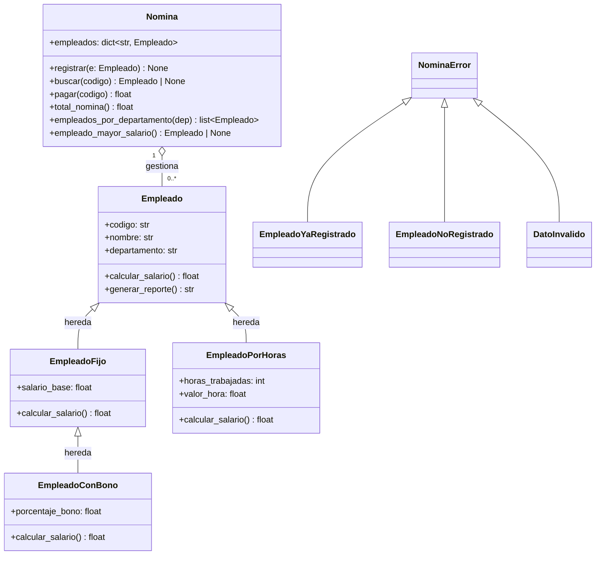

# Ejercicio 26 — Nómina de Empleados: Herencia y Manejo de Excepciones

---

## Descripción del problema

> *Una empresa necesita un sistema para calcular la nómina de sus empleados. La empresa tiene tres tipos de empleados: empleados de planta con salario fijo mensual, empleados por horas que cobran según las horas trabajadas en el mes, y empleados de planta con bono que reciben su salario base más un porcentaje adicional. Todos los empleados tienen un código único, un nombre y pertenecen a un departamento. El sistema debe registrar empleados, calcular lo que se le paga a cada uno y generar reportes. El área de nómina también necesita consultar el total a pagar en el mes, listar empleados por departamento y saber quién recibe el mayor salario.*

---

## Diagrama de clases



---

## Jerarquía de excepciones — ya definida

```python
class NominaError(Exception):
    """Base de todos los errores del dominio."""
    pass

class EmpleadoYaRegistrado(NominaError):
    """Se intenta registrar un código que ya existe."""
    pass

class EmpleadoNoRegistrado(NominaError):
    """Se opera sobre un código que no existe."""
    pass

class DatoInvalido(NominaError):
    """Un atributo no cumple las reglas del dominio."""
    pass
```

---

## Especificación de clases

### `Empleado` — clase base

| Atributo | Tipo | Restricción |
|----------|------|-------------|
| `codigo` | `str` | no vacío |
| `nombre` | `str` | no vacío |
| `departamento` | `str` | no vacío |

| Método | Descripción |
|--------|-------------|
| `calcular_salario() -> float` | Cada subclase la sobrescribe con su propia lógica de cálculo. |
| `generar_reporte() -> str` | Retorna una línea con código, nombre, departamento y salario formateado. |

> Cualquier campo vacío debe lanzar `DatoInvalido`.

---

### `EmpleadoFijo(Empleado)`

| Atributo extra | Tipo | Restricción |
|----------------|------|-------------|
| `salario_base` | `float` | `> 0` |

- `calcular_salario()` → retorna `salario_base`.

---

### `EmpleadoPorHoras(Empleado)`

| Atributo extra | Tipo | Restricción |
|----------------|------|-------------|
| `horas_trabajadas` | `int` | `>= 0` |
| `valor_hora` | `float` | `> 0` |

- `calcular_salario()` → retorna `horas_trabajadas * valor_hora`.

---

### `EmpleadoConBono(EmpleadoFijo)`

| Atributo extra | Tipo | Restricción |
|----------------|------|-------------|
| `porcentaje_bono` | `float` | `0 < porcentaje_bono <= 100` |

- `calcular_salario()` → retorna `salario_base * (1 + porcentaje_bono / 100)`.

> Hereda de `EmpleadoFijo`, no de `Empleado` directamente.

---

### `Nomina` — clase normal

| Atributo | Tipo | Descripción |
|----------|------|-------------|
| `empleados` | `dict[str, Empleado]` | indexado por `codigo` |

| Método | Descripción |
|--------|-------------|
| `registrar(e: Empleado) -> None` | Lanza `EmpleadoYaRegistrado` si el código ya existe. |
| `buscar(codigo: str) -> Empleado \| None` | Retorna el empleado o `None`. |
| `pagar(codigo: str) -> float` | Lanza `EmpleadoNoRegistrado` si no existe; retorna `calcular_salario()`. |
| `total_nomina() -> float` | Suma de todos los salarios. |
| `empleados_por_departamento(dep: str) -> list[Empleado]` | List comprehension. |
| `empleado_mayor_salario() -> Empleado \| None` | Empleado con mayor salario; `None` si no hay nadie. |

---

## Tu tarea

### Parte 1 — Diagrama de clases

Dibuja el diagrama de clases completo con la jerarquía de empleados, la clase `Nomina`, las excepciones y sus relaciones.

### Parte 2 — Implementación

Implementa todas las clases en Python. Requisitos:
- Usa type hints en todos los métodos.
- Las validaciones lanzan `DatoInvalido` con un mensaje descriptivo.
- `Nomina` no valida los datos del empleado: confía en que las clases lo hacen.

---

## Lo que debes demostrar

### 1. Crear empleados y verificar salarios

Crea los siguientes objetos e imprime su salario y reporte:

| Variable | Clase | Datos |
|----------|-------|-------|
| `e1` | `EmpleadoFijo` | codigo=`"E01"`, nombre=`"Ana Torres"`, departamento=`"TI"`, salario_base=`3_500_000.0` |
| `e2` | `EmpleadoPorHoras` | codigo=`"E02"`, nombre=`"Carlos Ruiz"`, departamento=`"Ventas"`, horas_trabajadas=`120`, valor_hora=`25_000.0` |
| `e3` | `EmpleadoConBono` | codigo=`"E03"`, nombre=`"Laura Díaz"`, departamento=`"TI"`, salario_base=`4_000_000.0`, porcentaje_bono=`15.0` |

Salidas esperadas de `calcular_salario()`:
- `e1` → `3500000.0`
- `e2` → `3000000.0`
- `e3` → `4600000.0`

---

### 2. Registrar y operar sobre la nómina

Crea una `Nomina`, registra los tres empleados y verifica:

| Operación | Resultado esperado |
|-----------|--------------------|
| `buscar("E01").nombre` | `"Ana Torres"` |
| `buscar("E99")` | `None` |
| `pagar("E02")` | `3000000.0` |
| `total_nomina()` | `11100000.0` |
| `len(empleados_por_departamento("TI"))` | `2` |
| `empleado_mayor_salario().nombre` | `"Laura Díaz"` |

---

### 3. Demostrar polimorfismo

Recorre una lista con los tres empleados y llama `calcular_salario()` en cada uno sin saber de qué tipo concreto es.

---

### 4. Verificar excepciones

Usando bloques `try/except`, demuestra que el sistema lanza la excepción correcta en cada caso:

| Situación | Excepción esperada |
|-----------|--------------------|
| Registrar `e1` por segunda vez | `EmpleadoYaRegistrado` |
| Llamar `pagar("E99")` | `EmpleadoNoRegistrado` |
| Crear `EmpleadoFijo` con `salario_base=-500.0` | `DatoInvalido` |
| Crear `EmpleadoConBono` con `porcentaje_bono=150.0` | `DatoInvalido` |
| Crear `EmpleadoPorHoras` con `horas_trabajadas=-10` | `DatoInvalido` |
