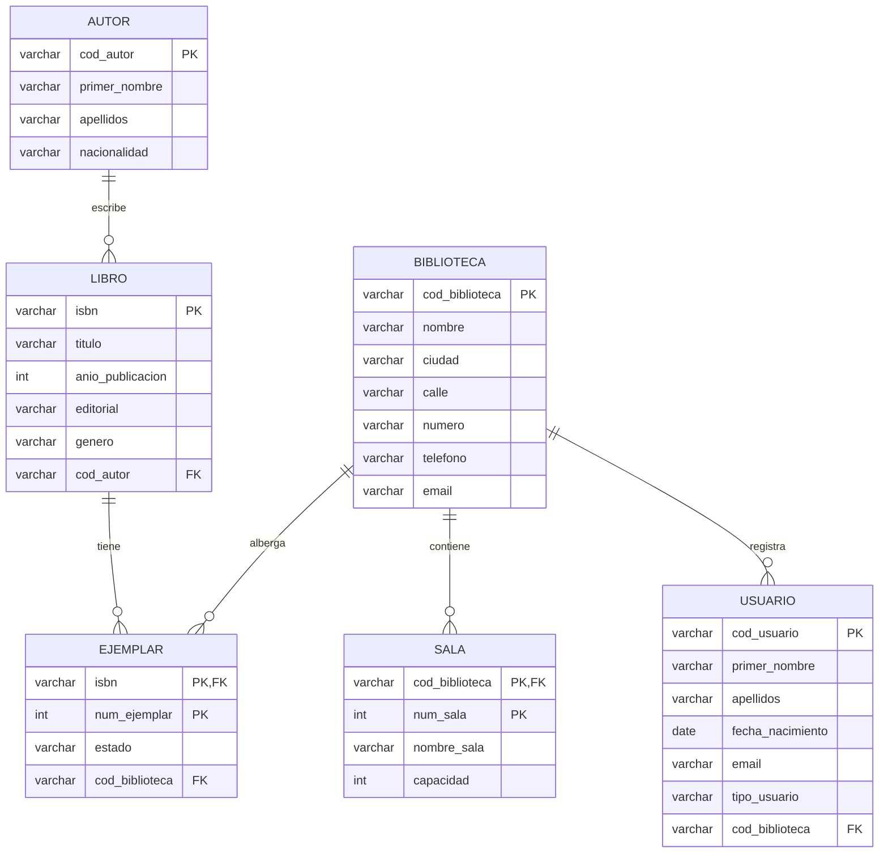

# Clase 11 — Práctica DDL
**Dominio:** sistema de biblioteca universitaria

**Objetivo:** a partir del esquema relacional completo que se entrega a continuación,
escribe tú mismo todas las instrucciones `CREATE TABLE` en pgAdmin.
No hay ejercicios guiados — aplicas directamente lo que aprendiste hoy.

> Declara las llaves foráneas con `REFERENCES` apuntando a la tabla padre.
> Recuerda crear las tablas en orden correcto: primero las que no dependen de nadie.

---

## El modelo que debes implementar

Este es el esquema relacional del sistema de biblioteca. Úsalo como plano de construcción.

```
BIBLIOTECA(cod_biblioteca [PK], nombre, ciudad, calle, numero, telefono, email)

SALA(cod_biblioteca [PK, FK], num_sala [PK], nombre_sala, capacidad)

LIBRO(isbn [PK], titulo, anio_publicacion, editorial, genero, cod_autor [FK])

AUTOR(cod_autor [PK], primer_nombre, apellidos, nacionalidad)

USUARIO(cod_usuario [PK], primer_nombre, apellidos, fecha_nacimiento, email, tipo_usuario, cod_biblioteca [FK])

EJEMPLAR(isbn [PK, FK], num_ejemplar [PK], estado, cod_biblioteca [FK])
```

> `[PK]` = clave primaria · las columnas marcadas con `[PK]` forman la clave de esa tabla.
> Cuando hay más de un `[PK]`, la clave es **compuesta**.

### Diagrama relacional

> Las líneas representan las llaves foráneas (`REFERENCES`) entre tablas.



---

## Paso 0: Limpiar antes de crear

Ejecuta esto primero. Así puedes volver a correr tu script sin errores si te equivocas.

```sql
DROP TABLE IF EXISTS ejemplar;
DROP TABLE IF EXISTS usuario;
DROP TABLE IF EXISTS sala;
DROP TABLE IF EXISTS libro;
DROP TABLE IF EXISTS autor;
DROP TABLE IF EXISTS biblioteca;
```

> La FK en cada tabla impone el orden: primero caen las que tienen `REFERENCES`, luego las referenciadas.

---

## Tablas a implementar

### Tabla 1: BIBLIOTECA

| Columna | Tipo | Restricción |
|---|---|---|
| `cod_biblioteca` | texto hasta 10 chars | clave primaria |
| `nombre` | texto hasta 100 chars | obligatorio |
| `ciudad` | texto hasta 50 chars | obligatorio |
| `calle` | texto hasta 100 chars | opcional |
| `numero` | texto hasta 10 chars | opcional |
| `telefono` | texto hasta 15 chars | opcional |
| `email` | texto hasta 150 chars | opcional |

```sql
-- TODO: escribe el CREATE TABLE biblioteca
```

Verifica con:

```sql
-- INSERT INTO biblioteca VALUES ('BIB01', 'Biblioteca Central', 'Medellín', 'Calle 67', '53-108', '6044448899', 'central@universidad.edu.co');
-- INSERT INTO biblioteca VALUES ('BIB02', 'Biblioteca Norte',   'Bogotá',   NULL,       NULL,    NULL,         NULL);
-- SELECT * FROM biblioteca;
```

---

### Tabla 2: AUTOR

| Columna | Tipo | Restricción |
|---|---|---|
| `cod_autor` | texto hasta 10 chars | clave primaria |
| `primer_nombre` | texto hasta 50 chars | obligatorio |
| `apellidos` | texto hasta 100 chars | obligatorio |
| `nacionalidad` | texto hasta 50 chars | opcional |

```sql
-- TODO: escribe el CREATE TABLE autor
```

Verifica con:

```sql
-- INSERT INTO autor VALUES ('AUT001', 'Abraham', 'Silberschatz', 'Estadounidense');
-- INSERT INTO autor VALUES ('AUT002', 'Ramez',   'Elmasri',      'Sirio');
-- SELECT * FROM autor;
```

---

### Tabla 3: SALA

| Columna | Tipo | Restricción |
|---|---|---|
| `cod_biblioteca` | texto hasta 10 chars | parte de la PK · FK → `REFERENCES biblioteca(cod_biblioteca)` |
| `num_sala` | número entero | parte de la clave primaria |
| `nombre_sala` | texto hasta 80 chars | opcional |
| `capacidad` | número entero | opcional |

> La PK es **compuesta**: una sala se identifica por la combinación de biblioteca + número.
> ¿Recuerdas cómo se declara la PK compuesta? (pista: nivel de tabla, al final).

```sql
-- TODO: escribe el CREATE TABLE sala
```

Verifica con:

```sql
-- INSERT INTO sala VALUES ('BIB01', 1, 'Sala de lectura silenciosa', 40);
-- INSERT INTO sala VALUES ('BIB01', 2, 'Sala de trabajo grupal',     20);
-- INSERT INTO sala VALUES ('BIB02', 1, 'Sala general',               60);
-- SELECT * FROM sala;
```

---

### Tabla 4: LIBRO

| Columna | Tipo | Restricción |
|---|---|---|
| `isbn` | texto hasta 20 chars | clave primaria |
| `titulo` | texto hasta 200 chars | obligatorio |
| `anio_publicacion` | número entero | opcional |
| `editorial` | texto hasta 100 chars | opcional |
| `genero` | texto hasta 50 chars | opcional |
| `cod_autor` | texto hasta 10 chars | obligatorio · FK → `REFERENCES autor(cod_autor)` |

```sql
-- TODO: escribe el CREATE TABLE libro
```

Verifica con:

```sql
-- INSERT INTO libro VALUES ('978-958-771-000-1', 'Fundamentos de Bases de Datos', 2019, 'Pearson',   'Tecnología', 'AUT001');
-- INSERT INTO libro VALUES ('978-958-771-000-2', 'Introducción a SQL',            2021, 'O''Reilly', 'Tecnología', 'AUT002');
-- SELECT * FROM libro;
```

---

### Tabla 5: USUARIO

| Columna | Tipo | Restricción |
|---|---|---|
| `cod_usuario` | texto hasta 20 chars | clave primaria |
| `primer_nombre` | texto hasta 50 chars | obligatorio |
| `apellidos` | texto hasta 100 chars | obligatorio |
| `fecha_nacimiento` | fecha | obligatorio |
| `email` | texto hasta 150 chars | opcional |
| `tipo_usuario` | texto hasta 20 chars | obligatorio |
| `cod_biblioteca` | texto hasta 10 chars | obligatorio · FK → `REFERENCES biblioteca(cod_biblioteca)` |

> `tipo_usuario` puede ser: `'estudiante'`, `'docente'` o `'externo'`.
> Por ahora lo guardamos como texto libre; en clase 14 aprenderás a restringirlo con `CHECK`.

```sql
-- TODO: escribe el CREATE TABLE usuario
```

Verifica con:

```sql
-- INSERT INTO usuario VALUES ('CC-1001234', 'Sofía',   'Herrera Mora', '2003-11-05', 'sofia@uni.edu.co', 'estudiante', 'BIB01');
-- INSERT INTO usuario VALUES ('CE-5559871', 'Ricardo', 'Parra Leal',   '1985-06-20', NULL,              'docente',    'BIB02');
-- SELECT * FROM usuario;
```

---

### Tabla 6: EJEMPLAR

| Columna | Tipo | Restricción |
|---|---|---|
| `isbn` | texto hasta 20 chars | parte de la PK · FK → `REFERENCES libro(isbn)` |
| `num_ejemplar` | número entero | parte de la clave primaria |
| `estado` | texto hasta 20 chars | opcional |
| `cod_biblioteca` | texto hasta 10 chars | obligatorio · FK → `REFERENCES biblioteca(cod_biblioteca)` |

> Un ejemplar es una copia física de un libro. El mismo `isbn` puede tener varios ejemplares
> con distintos `num_ejemplar`. La PK compuesta garantiza que no haya dos veces el mismo par.

```sql
-- TODO: escribe el CREATE TABLE ejemplar
```

Verifica con:

```sql
-- INSERT INTO ejemplar VALUES ('978-958-771-000-1', 1, 'disponible', 'BIB01');
-- INSERT INTO ejemplar VALUES ('978-958-771-000-1', 2, 'prestado',   'BIB01');
-- INSERT INTO ejemplar VALUES ('978-958-771-000-1', 3, 'disponible', 'BIB02');
-- SELECT * FROM ejemplar;
```

---

## Verificación final

Una vez creadas las seis tablas, ejecuta este bloque para confirmar que todas existen
y tienen datos:

```sql
SELECT 'biblioteca' AS tabla, COUNT(*) AS filas FROM biblioteca
UNION ALL SELECT 'sala',      COUNT(*) FROM sala
UNION ALL SELECT 'libro',     COUNT(*) FROM libro
UNION ALL SELECT 'autor',     COUNT(*) FROM autor
UNION ALL SELECT 'usuario',   COUNT(*) FROM usuario
UNION ALL SELECT 'ejemplar',  COUNT(*) FROM ejemplar;
```

El resultado esperado es 6 filas, cada una con al menos 1 en la columna `filas`.

---

## Reto — Violaciones de restricciones

Intenta ejecutar cada una de las siguientes instrucciones y explica el error que produce PostgreSQL:

a) Insertar un libro sin título  
b) Insertar un ejemplar con `isbn` + `num_ejemplar` ya existente  
c) Insertar un usuario sin `tipo_usuario`  
d) Insertar una sala con `cod_biblioteca = 'BIB01'` y `num_sala = 1` por segunda vez  
e) Insertar un libro con `cod_autor = 'AUT999'` (que no existe)  
f) Insertar un ejemplar con un `isbn` que no existe en `libro`

> ¿Qué restricción viola cada caso? ¿PK, NOT NULL o FK?
