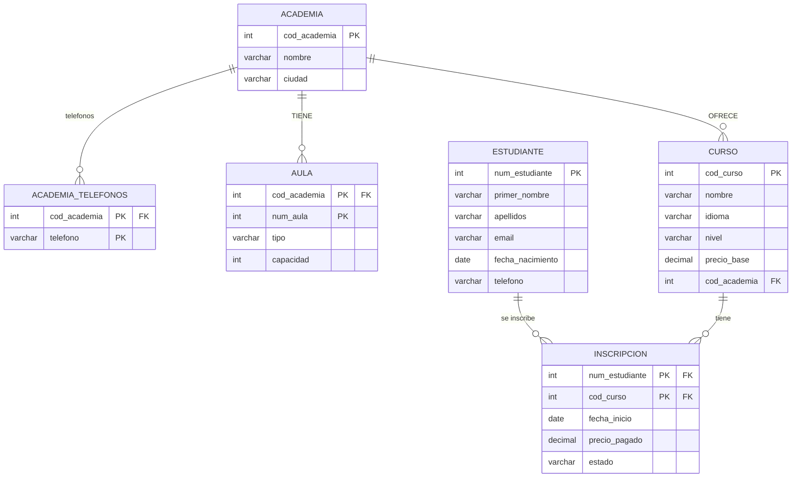

# Clase 10 — Del Modelo E-R al Modelo Relacional
**Materia:** Modelo de Datos | **Semestre:** 4 | **Ingeniería de Sistemas**
**Herramienta:** papel y lápiz (o draw.io en modo diagrama de tabla)

---

## Repaso — La cadena de diseño

```
Mundo real
    ↓  análisis de requisitos
Diagrama E-R (modelo conceptual)     ← Clases 4, 7, 8, 9
    ↓  transformación  ← Estamos aquí
Esquema relacional (modelo lógico)
    ↓  implementación
SQL en PostgreSQL                     ← Clases 11 en adelante
```

El diagrama E-R describe **qué** datos existen y cómo se relacionan.
El esquema relacional dice **cómo** se organizan esos datos en tablas.
El modelo relacional es independiente del DBMS pero se implementa directamente en SQL.

---

## 0. MER vs MR — ¿en qué se diferencian?

Antes de construir el esquema relacional es útil entender qué lo distingue del diagrama E-R.

| Aspecto | MER (Modelo Entidad-Relación) | MR (Modelo Relacional) |
|---------|-------------------------------|------------------------|
| Unidad básica | Entidad | Tabla |
| Atributos y tipos de datos | ❌ No especifica | ✅ Sí especifica |
| Claves primarias y foráneas | ❌ Solo la clave conceptual | ✅ Marca PK y FK explícitamente |
| Relaciones que representa | Todas: 1:1, 1:N, N:1, M:N | Solo 1:N y N:1 (1:1 solo en casos puntuales) |
| Propósito | Modelar el problema conceptualmente | Diseñar la estructura de la BD |
| Nivel del modelo | Conceptual | Lógico |

### Mini-ejemplo comparativo

**MER:**
```
Profesor ——————<  Curso
         1        N
```

**MR:**
```
PROFESORES(ID [PK], TIPO_ID, NOMBRE, CARGO)
CURSOS(ID [PK], NOMBRE, ID_PROFESOR [FK → PROFESORES])
```

En el MR desaparece el rombo de relación. La cardinalidad 1:N se implementa
colocando la FK en el lado N (en CURSOS).

---

## 1. Notación del esquema relacional

Un **esquema relacional** se escribe así:

```
NOMBRE_TABLA(columna1, columna2, columna3, ...)
```

Convenciones en este curso:

| Convención | Significado |
|------------|-------------|
| `atributo [PK]` | Clave primaria — identifica unívocamente cada fila |
| `atributo [FK → TABLA]` | Clave foránea — referencia a la PK de otra tabla |
| `atributo [PK, FK → TABLA]` | Es PK y FK al mismo tiempo |
| `atributo?` | Columna nullable (puede ser NULL) |
| `#atributo` | Atributo derivado — **no se incluye** en la tabla |

---

## Concepto: Clave foránea (FK)

Una **clave foránea** es un campo en una tabla que contiene la clave primaria
de **otra** tabla. Es el mecanismo con el que las tablas se relacionan entre sí.

**Propiedades:**
- Es la PK en la tabla referenciada.
- **Puede repetirse** (a diferencia de la PK).
- Debe ser del mismo tipo de dato que la PK a la que apunta.
- En una relación 1:N, la FK siempre va en el lado N.

### Ejemplo con datos reales

*Tabla: CLIENTES*

| ID (PK) | NOMBRE | DIRECCIÓN |
|---------|--------|-----------|
| 12345 | Bill Gates | Calle 50 # 40 - 30 |
| 45678 | Steve Jobs | Carrera 1 Sur # 10 - 15 |
| 54321 | Jeff Bezos | — |

*Tabla: VENTAS*

| FACTURA (PK) | ID_CLIENTE (FK) | FECHA_VENTA |
|-------------|-----------------|-------------|
| 10001 | 12345 | 2020-02-15 |
| 10002 | 54321 | 2020-02-16 |
| 10003 | 12345 | 2020-03-15 |

Observaciones:
- `ID` en CLIENTES es la **PK** — no se repite.
- `ID_CLIENTE` en VENTAS es la **FK** — apunta a CLIENTES y **sí se repite**
  (el cliente 12345 aparece en las facturas 10001 y 10003).
- La FK garantiza **integridad referencial**: no se puede insertar una venta con un
  `ID_CLIENTE` que no exista en CLIENTES.

### PK vs FK — comparación rápida

| Propiedad | Clave primaria (PK) | Clave foránea (FK) |
|-----------|---------------------|--------------------|
| Identifica | Al registro en su propia tabla | Al registro en otra tabla |
| ¿Puede repetirse? | ❌ No | ✅ Sí |
| ¿Puede ser NULL? | ❌ No | ✅ Sí (si la participación es parcial) |
| ¿Cuántas por tabla? | Exactamente una | Una o más |

---

## 2. Las nueve reglas de conversión

---

### Regla 1 — Entidad fuerte → tabla

Cada entidad fuerte se convierte en una tabla. Sus atributos simples se convierten en columnas.
El atributo clave del E-R se convierte en la PK.

**Ejemplo:**

E-R:
```
CLIENTE(cod_cliente [clave], nombre, email, fecha_registro)
```

Relacional:
```
CLIENTE(cod_cliente [PK], nombre, email, fecha_registro)
```

---

### Regla 2 — Atributo compuesto → aplanar

Los atributos compuestos **no** se trasladan como un solo campo. Se trasladan los **sub-atributos**
como columnas individuales. El nombre compuesto desaparece.

**Ejemplo:**

E-R: CLIENTE tiene `dirección` compuesto por `calle`, `número`, `ciudad`.

Relacional:
```
CLIENTE(cod_cliente [PK], nombre, email, calle, número, ciudad)
```

> El campo `dirección` no existe en la tabla — sus partes sí.

---

### Regla 3 — Atributo derivado → omitir

Los atributos derivados **no** se almacenan. Se calculan en el momento de la consulta.
No aparecen en el esquema relacional.

**Ejemplo:**

E-R: PACIENTE tiene `fecha_nacimiento` y `edad` (derivado).

Relacional:
```
PACIENTE(num_paciente [PK], nombre, fecha_nacimiento)
```

> `edad` no aparece. Se calcula con `CURRENT_DATE - fecha_nacimiento` en cada consulta.

---

### Regla 4 — Atributo multivaluado → nueva tabla

Un atributo multivaluado no puede ser una columna (una celda no puede tener varios valores).
Se convierte en una **tabla separada** cuya PK es la combinación de la FK a la tabla
propietaria más el valor.

**Ejemplo:**

E-R: INSTRUCTOR tiene `especialidades` [multivaluado].

Relacional:
```
INSTRUCTOR(cod_instructor [PK], nombre, teléfono)

INSTRUCTOR_ESPECIALIDADES(cod_instructor [PK, FK → INSTRUCTOR], especialidad [PK])
```

> Cada especialidad ocupa una fila. Un instructor con 3 especialidades tiene 3 filas
> en INSTRUCTOR_ESPECIALIDADES.

---

### Regla 5 — Entidad débil → tabla con PK compuesta

La tabla de una entidad débil tiene como PK la combinación de:
- La **FK** hacia la tabla de la entidad propietaria
- El **discriminante** (clave parcial) de la entidad débil

**Ejemplo:**

E-R: SALA (débil de SEDE, discriminante: `num_sala`).

Relacional:
```
SEDE(cod_sede [PK], nombre, ciudad, teléfono)

SALA(cod_sede [PK, FK → SEDE], num_sala [PK], nombre_sala, tipo, capacidad)
```

> La clave de una sala es siempre la combinación `(cod_sede, num_sala)`.
> El `num_sala` solo no identifica la sala — necesita la sede.

---

### Regla 6 — Relación 1:N → FK en el lado N

En una relación 1:N, la tabla del lado **N** recibe una columna adicional: la FK hacia la PK
de la tabla del lado **1**. No se crea ninguna tabla nueva.

**Ejemplo:**

E-R: DEPARTAMENTO (1) — TIENE — EMPLEADO (N). Participación: EMPLEADO total, DEPARTAMENTO parcial.

Relacional:
```
DEPARTAMENTO(cod_departamento [PK], nombre)

EMPLEADO(cod_empleado [PK], nombre, salario, cod_departamento [FK → DEPARTAMENTO])
```

> La FK `cod_departamento` en EMPLEADO apunta al departamento al que pertenece.
> Como EMPLEADO tiene participación total, esta FK será NOT NULL en SQL.
> Si fuera parcial, la FK podría ser NULL.

---

### Regla 7 — Relación 1:1 → FK en la tabla de participación total

En una relación 1:1 se agrega la FK en la tabla que tiene **participación total** (la que
siempre debe participar). Si ambas son totales o ambas son parciales, se elige cualquiera
o se fusionan en una sola tabla.

**Ejemplo:**

E-R: EMPLEADO (1) — ES_GERENTE_DE — DEPARTAMENTO (1). DEPARTAMENTO tiene participación total
(todo departamento tiene gerente), EMPLEADO tiene participación parcial (no todo empleado
es gerente).

Relacional:
```
EMPLEADO(cod_empleado [PK], nombre, salario)

DEPARTAMENTO(cod_departamento [PK], nombre, cod_empleado [FK → EMPLEADO])
```

> La FK va en DEPARTAMENTO porque esa es la tabla de participación total.

---

### Regla 8 — Relación M:N sin atributos → tabla de unión

Una relación M:N se convierte en una **nueva tabla** que contiene las FKs hacia ambas tablas
participantes. La PK de esta tabla es la combinación de ambas FKs.

**Ejemplo:**

E-R: LIBRO (M) — ESCRITO_POR — AUTOR (N). Sin atributos propios.

Relacional:
```
LIBRO(isbn [PK], título, año, precio)
AUTOR(cod_autor [PK], nombre, país)

LIBRO_AUTOR(isbn [PK, FK → LIBRO], cod_autor [PK, FK → AUTOR])
```

> En el modelo relacional no existe una forma directa de representar M:N sin tabla intermedia.
> Una FK simple solo puede apuntar a **un** registro — no a varios.

#### ¿Por qué se evitan las relaciones M:N directas?

Modelo incorrecto — un curso con FK a un solo profesor:
```
PROFESORES(ID [PK], TIPO_ID, NOMBRE)
CURSOS(ID [PK], NOMBRE, ID_PROFESOR [FK → PROFESORES])
```
Si un curso puede tener varios profesores, esta FK no es suficiente.

Modelo correcto — tabla intermedia que convierte la M:N en dos relaciones 1:N:
```
PROFESORES(ID [PK], TIPO_ID, NOMBRE)
PROFES_X_CURSO(ID_PROFE [PK, FK → PROFESORES], ID_CURSO [PK, FK → CURSOS], AULA)
CURSOS(ID [PK], NOMBRE)
```
- Si la tabla intermedia tiene atributos propios (como `AULA`) → aplica **Regla 9**.
- Si no tiene atributos propios → aplica **Regla 8**.

---

### Regla 9 — Entidad asociativa / M:N con atributos → tabla de unión con columnas

Igual que la Regla 8, pero la tabla de unión además incluye los atributos propios de la
entidad asociativa como columnas adicionales.

**Ejemplo:**

E-R: EMPLEADO (M) ↔ PROYECTO (N) → ASIGNACIÓN (horas_semanales, rol).

Relacional:
```
EMPLEADO(cod_empleado [PK], nombre)
PROYECTO(cod_proyecto [PK], nombre, presupuesto)

ASIGNACIÓN(cod_empleado [PK, FK → EMPLEADO], cod_proyecto [PK, FK → PROYECTO],
           horas_semanales, rol)
```

> `horas_semanales` y `rol` son propios de la asignación — no pertenecen ni al empleado
> ni al proyecto por separado.

---

## 3. Tabla resumen de reglas

| Elemento E-R | Resultado en el modelo relacional |
|-------------|----------------------------------|
| Entidad fuerte | Nueva tabla |
| Atributo simple | Columna |
| Atributo clave | PK |
| Atributo compuesto | Se aplana: una columna por sub-atributo |
| Atributo derivado | **No se incluye** |
| Atributo multivaluado | Nueva tabla con FK + valor como PK compuesta |
| Atributo opcional (nullable) | Columna que acepta NULL |
| Entidad débil | Nueva tabla; PK = FK_propietaria + discriminante |
| Relación 1:N | FK en la tabla del lado N |
| Relación 1:1 | FK en la tabla de participación total |
| Relación M:N (sin atributos) | Nueva tabla de unión con ambas FKs como PK |
| Entidad asociativa (M:N con atributos) | Nueva tabla de unión con ambas FKs + columnas propias |

---

## 4. Ejemplo completo paso a paso

### E-R de partida

Dominio: sistema de una academia de idiomas (simplificado).

```
ACADEMIA(cod_academia [clave], nombre, ciudad, teléfonos[multivaluado])

AULA(débil de ACADEMIA, discriminante: num_aula, tipo, capacidad)

ESTUDIANTE(num_estudiante [clave], nombre[compuesto: primer_nombre, apellidos],
           email, fecha_nacimiento, edad[derivado], teléfono)

CURSO(cod_curso [clave], nombre, idioma, nivel, precio_base)

INSCRIPCIÓN — entidad asociativa de ESTUDIANTE × CURSO —
  atributos: fecha_inicio, precio_pagado, estado
```

Relaciones:
- ACADEMIA TIENE AULA (1:N, identificadora)
- ACADEMIA OFRECE CURSO (1:N) — total CURSO, parcial ACADEMIA
- ESTUDIANTE × CURSO → INSCRIPCIÓN (M:N, asociativa)

**Diagrama E-R de partida:**

```mermaid
flowchart LR
    ACADEMIA["ACADEMIA"]
    AULA[["AULA\n(débil de ACADEMIA)"]]
    ESTUDIANTE["ESTUDIANTE"]
    CURSO["CURSO"]
    INSCRIPCION["INSCRIPCIÓN\n(asociativa)"]

    ACADEMIA =="|1|"=== TIENE{"TIENE\n(identificadora)"}
    TIENE =="|N|"=== AULA

    ACADEMIA --|"1|"|--- OFRECE{"OFRECE"}
    OFRECE =="|N|"=== CURSO

    ESTUDIANTE --|"1|"|--- SE_INSCRIBE{"SE_INSCRIBE_EN"}
    SE_INSCRIBE --|"N|"|--- INSCRIPCION
    CURSO --|"1|"|--- TIENE_I{"TIENE"}
    TIENE_I --|"N|"|--- INSCRIPCION
```

> Línea doble (`===`) = participación total &nbsp;|&nbsp; Línea simple (`---`) = participación parcial

### Conversión paso a paso

**Paso 1 — Entidades fuertes:**
```
ACADEMIA(cod_academia [PK], nombre, ciudad)
ESTUDIANTE(num_estudiante [PK], primer_nombre, apellidos, email, fecha_nacimiento, teléfono)
CURSO(cod_curso [PK], nombre, idioma, nivel, precio_base)
```

> `edad` derivado → omitido. `nombre` compuesto → aplanado en primer_nombre + apellidos.

**Paso 2 — Atributo multivaluado de ACADEMIA:**
```
ACADEMIA_TELEFONOS(cod_academia [PK, FK → ACADEMIA], teléfono [PK])
```

**Paso 3 — Entidad débil AULA:**
```
AULA(cod_academia [PK, FK → ACADEMIA], num_aula [PK], tipo, capacidad)
```

**Paso 4 — Relación 1:N ACADEMIA → CURSO:**
```
-- FK en el lado N (CURSO):
CURSO(cod_curso [PK], nombre, idioma, nivel, precio_base, cod_academia [FK → ACADEMIA])
```

**Paso 5 — Entidad asociativa INSCRIPCIÓN:**
```
INSCRIPCIÓN(num_estudiante [PK, FK → ESTUDIANTE], cod_curso [PK, FK → CURSO],
            fecha_inicio, precio_pagado, estado)
```

### Esquema relacional final

```
ACADEMIA(cod_academia [PK], nombre, ciudad)

ACADEMIA_TELEFONOS(cod_academia [PK, FK → ACADEMIA], teléfono [PK])

AULA(cod_academia [PK, FK → ACADEMIA], num_aula [PK], tipo, capacidad)

ESTUDIANTE(num_estudiante [PK], primer_nombre, apellidos, email, fecha_nacimiento, teléfono)

CURSO(cod_curso [PK], nombre, idioma, nivel, precio_base, cod_academia [FK → ACADEMIA])

INSCRIPCIÓN(num_estudiante [PK, FK → ESTUDIANTE], cod_curso [PK, FK → CURSO],
            fecha_inicio, precio_pagado, estado)
```

**Diagrama relacional resultante:**



6 entidades en el E-R → 6 tablas (2 extras por multivaluado y débil = 6 total con las principales).

---

## 5. Lo que viene en la próxima clase

En clase 11 convertimos el esquema relacional en **SQL DDL**:
cada tabla se escribe como `CREATE TABLE` con sus tipos de datos y restricciones.

```
-- El esquema relacional se convierte directamente en SQL:
ACADEMIA(cod_academia [PK], nombre, ciudad)
  ↓
CREATE TABLE ACADEMIA (
    cod_academia SERIAL PRIMARY KEY,
    nombre       VARCHAR(100) NOT NULL,
    ciudad       VARCHAR(50)  NOT NULL
);
```
